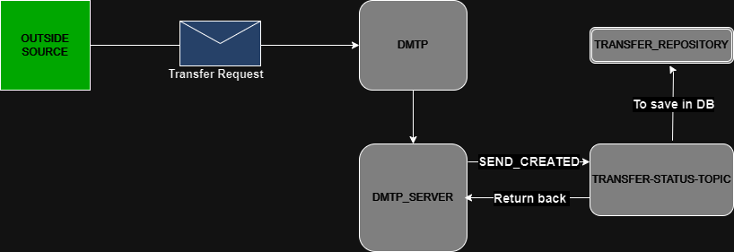
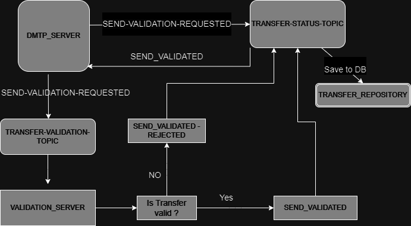
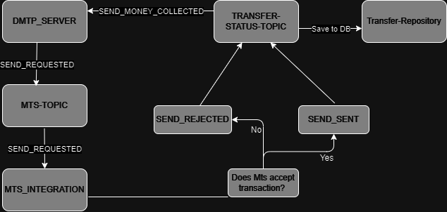

# Kafka Topics Overview

This document describes the Kafka topics used in the DMTP microservices architecture for communication between services.

## Key Topics

### 1. **TRANSFER-STATUS-TOPIC**
- **Used by:** DMTP_SERVER, TRANSFER_REPOSITORY, VALIDATION_SERVER, FI_INTEGRATION, MTS_INTEGRATION.
- **Description:** When a transfer request first enters DMTP, the DMTP_SERVER sends it to this topic, where the transfer status is set to either `SEND-CREATED` or `RECEIVE-CREATED`, depending on the transfer type. From that point onward, the topic tracks the status of the transfer, and every status change is published here. Services like `TRANSFER-REPOSITORY` listen to this topic to update the status in the database.
- **Status updates:**
    - `SEND-CREATED`, `SEND-VALIDATION-REQUESTED`, `SEND-MONEY-COLLECTION-REQUESTED`, `SEND-VALIDATED`, `SEND-REJECTED`, `SEND-SENT`.
    - `RECEIVE-CREATED`, `RECEIVE-VALIDATION-REQUESTED`, `RECEIVE-PAY-REQUESTED`, `RECEIVE-REJECTED`, `RECEIVE-SENT`, `RECEIVE-MONEY-COLLECTED`.

      

### 2. **TRANSFER-VALIDATION-TOPIC**
- **Used by:** DMTP_SERVER, VALIDATION_SERVER.
  - **Description:** Used to validate transfers. When a transfer requires validation, it is sent to this topic, and the `VALIDATION_SERVER` processes it. If the transaction request is processed successfully, the transfer status will be set to `SEND_VALIDATED`/ `RECEIVE_VALIDATED`. If it fails the validation checks, the status will be set to `SEND_VALIDATION_REJECTED`/ `RECEIVE_VALIDATION_REJECTED`. In both cases, the transfer request is sent back to the `TRANSFER-STATUS-TOPIC`.  
    

### 3. **Fi-INTEGRATION-TOPIC**
- **Used by:** DMTP_SERVER, FI_INTEGRATION.
- **Description:** `FI_INTEGRATION` uses this topic to manage money transfers and initiate actions for transferring funds between bank accounts. After a message is sent to this topic, `FI_INTEGRATION` processes it and forwards it to another internal topic — `BANK-TRANSACTIONS-TOPIC`. This internal topic is used to send the transfer request to the bank for processing. Once the bank responds, if the transfer is successful, the status will be updated to `SEND_MONEY_COLLECTED`/ `RECEIVE_PAID`. If the bank rejects the transfer, the status will be SEND_MONEY_COLLECTION_REJECTED/ RECEIVE_PAY_REJECTED. In both cases, the status is sent back to the TRANSFER-STATUS-TOPIC.  

#### 3.1 **BANK-TRANSACTIONS-TOPIC**
- **Used by:** FI_INTEGRATION.
  - **Description:**  This topic is used to receive the final status of a scheduled bank transaction (e.g., processed, rejected, pending). `FI_INTEGRATION` sends multiple transaction attempts to this topic until the transfer either succeeds or reaches the maximum retry count. Once the final response from the bank is received by `FI_INTEGRATION`, it is forwarded to the `TRANSFER-STATUS-TOPIC`.
    

### 4. **MTS-TOPIC**
- **Used by:** DMTP_SERVER, MTS_INTEGRATION.
  - **Description:** After `FI_INTEGRATION` sends the bank's response to the `TRANSFER-STATUS-TOPIC`, the `DMTP_SERVER` updates the transfer status to either `SEND-REQUESTED` or `RECEIVE-REQUESTED` and forwards it to the `MTS-TOPIC`. `MTS-INTEGRATION` listens to this topic to process money transfers through external services. The results are then sent back to the `TRANSFER-STATUS-TOPIC` with one of the following statuses: `SEND_SENT`, `SEND_REJECTED`, `RECEIVE_PAID`, or `RECEIVE_PAY_REJECTED`.

    
